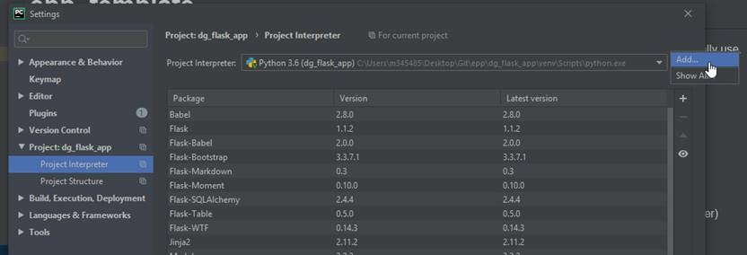

# Demand Group Flask App

This project is designed to allow CSAs the ability to edit orphaned Commodity | Sub-Commodity relationships as either add them to an exisiting Demand Group or create a new one.

### CSA Instructions
1. Click `edit` on the right side of the table for an orphaned Commodity | Sub-Commodity
2. Determine if the record should be added to an existing Demand Group or if a new Demand Group should be added.
    * If the record should be added to an existing Demand Group, either click a Demand Group line in the table below or manually enter the text
    * If the record needs a new Demand Group, enter the name of the Demand Group and the placeholder Demand Group code is the code which should be used.
3. Click `submit` to add the record to the database
4. Continue until all orphaned records have a Demand Group.

### DSR Instructions
To use locally:
1. Clone the project repo via GitBash and open in PyCharm
2. Add a vitrual environment as the interpreter in PyCharm.
    * Refer to [Confluence documentation](https://www.google.com) for more assistance on Virtual Enviroments
    
    
3. Opened up a terminal in PyCharm (which has been switched out to GitBash per the “Adding Git Bash to Pycharm - Access to Linux Commands in Terminal” section of this [page](https://cwww.google.com)), and activated the virtual environment using `source activate venv`
    * On your repo's main page, press the branch selector dropdown (immediately above your file list, currently set to Branch: master)
    * Type `dev` into the branch selector
    * Click "Create branch: dev'
4. Install all of your requirements using `pip install -r requirements.txt`
5. Initialize flask variables:
    * `export flask_app=apex_recreate_gui.py`
    * `export flask_env=development`
6. Run flask using `flask run`

    
